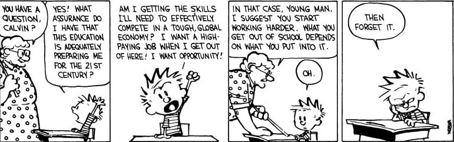

## Security  
- [Symmetric Key Crypto](https://www.youtube.com/channel/UCLlw-K3hvGx94l1POd0k2sw/playlists): One-hour Summary by Dan Boneh

## Courses
-  [CS 294-163: Decentralized Security: Theory and Systems
Fall 2019](https://inst.eecs.berkeley.edu/~cs294-163/fa19/), Raluca Ada Popa, UC Berkeley
- [CS 161: Computer Security](https://sp20.cs161.org/), Raluca Ada Popa, UC Berkeley
- [Computer Systems Security](https://www.csa.iisc.ac.in/~vg/teaching/SecurityLectures/), Vinod Ganapathy IISc
- [Foundations of Cryptography](https://nptel.ac.in/courses/106/106/106106221/), Ashish Choudhary NPTEL 
- Differential privacy, Gautam kamath, Bilibili twitter handle
- Cryptocurrency class, King's College London. [Link](https://blockchain.kcl.ac.uk/cryptocurrencyclass/)
- David Wu's [Courses](https://www.cs.virginia.edu/dwu4/teaching.html)
## Blogs
- [A Few Thoughts on Cryptographic Engineering](http://blog.cryptographyengineering.com/), Blogs by Matthew D. Green, Johns Hopkins University
- [Intro about Bitcoin](https://www.vpnmentor.com/blog/bitcoin-money-decentralization/), [How Pow works in Bitcoin](https://www.vpnmentor.com/blog/hash-puzzle-bitcoin/), Avishay Yanai, Barllan University
- [Crypto Blogs](http://esl.cs.brown.edu/blog/), Semy Kamara Brown University
- [A few lessons from the history of multiparty computation](https://theorydish.blog/2021/05/26/few-lessons-from-the-history-of-multiparty-computation/), Dima Kogan Stanford

## Others
- [Useful Cryptography Resources](https://blog.cryptographyengineering.com/useful-cryptography-resources/), A comprehensive list for crypto
- [Useful Resources on MPC](https://www.csa.iisc.ac.in/~cris/mpc_resources.html) Maintanied by Cris Lab IISC
- [Awesome list](https://github.com/sindresorhus/awesome) A place for all kinds of interesting topics
- [An Annotated Bibliography of Practical Secure Computation](https://web.engr.oregonstate.edu/~rosulekm/scbib/) Mike Rosulek OSU
- [Some Graduate Advices](http://web.engr.oregonstate.edu/~rosulekm/advising.html)
- Mihir Bellare's [course](https://cseweb.ucsd.edu/~mihir/cse209b-Wi21/) on "Seeing the invisible" at UCSD. 
